# Unreal Engine 5

## 概述

XVisio 对虚幻引擎的支持建立在虚幻引擎内置的 OpenXR 支持之上。这使得开发者无需编写任何 XVisio 特有的代码，即可使用虚幻引擎的常规二进制版本创建 XR 应用。它兼容所有当前的 XVisio 头显。

虚幻引擎内置的 OpenXR 插件不支持某些 XVisio 功能。这些功能由单独的 XVisio OpenXR 插件提供支持，该插件是对虚幻引擎内置插件的补充，并启用了额外的功能。

### 要求

要开始使用 Unreal 为 XVisio 头显进行开发，您需要以下工具：

一台满足XVisio头显设备系统要求的电脑
XVisio xervice （建议使用最新版本）
Unreal 5.0 或更高版本（建议使用更高版本以获得稳定性和新功能）
XVisio OpenXR 插件（需要此插件才能使用所有功能）

### 入门

按照“入门指南”页面上的步骤，开始一个新的 XVisio 项目。

### 推荐设置

有关 XVisio 头戴式设备与传统应用程序开发和其他 VR 设备相比有哪些不同的设置和功能的信息，请参阅推荐设置。

## 虚幻引擎5开发入门

开始之前，请确保您的开发环境满足要求。

打开一个现有项目或创建一个新项目。

您可以在 Unreal 中启用 OpenXR，而无需使用 XVisio 特有的功能。

在插件中，搜索XR并激活OpenXR、OpenXREyeTracker、OpenXRHandTracking。

在插件设置中，搜索VR并禁用OculusVR和SteamVR，只保留OpenXR 开启。完成后，重启编辑器。

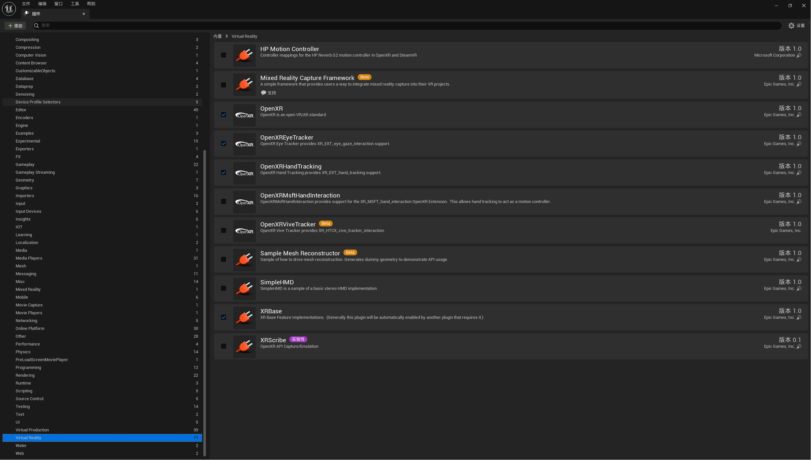

XVisio OpenXR 插件现已可以使用。您可以在“项目设置” > “插件” > “XVisio OpenXR”下找到插件设置。

选择VR 预览播放模式，然后点击播放按钮，即可在头戴式显示器内看到场景。

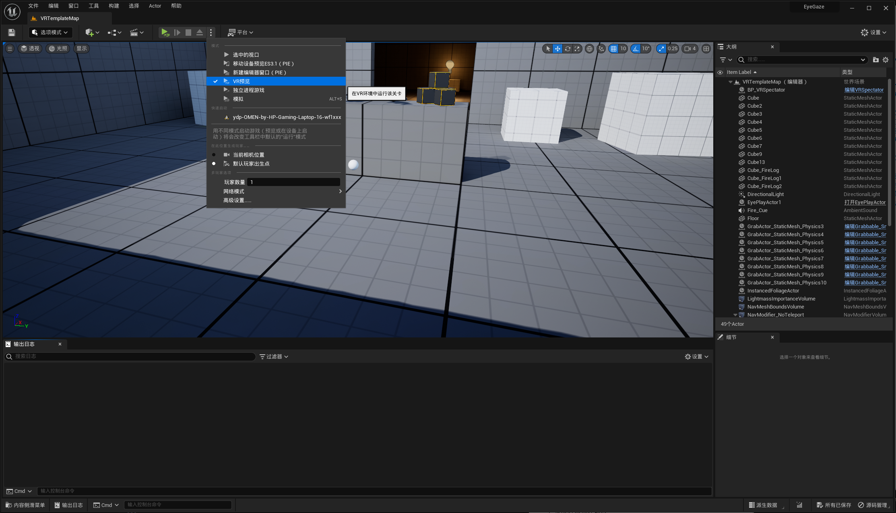

入门的好方法是使用XVisio OpenXR 示例项目。它基于 Unreal VR 模板构建，并提供了使用所有支持功能的简单示例。

VR模板
[Unreal VR模板](https://docs.unrealengine.com/5.0/en-US/vr-template-in-unreal-engine/)是您项目的良好起点。

**手动安装 XVisio OpenXR 插件**

为 Unreal 项目添加 XVisio 支持

打开一个现有的虚幻引擎项目或创建一个新项目。

从Downloads下载适用于 Unreal 的 XVisio OpenXR 插件，并解压缩包含该插件的 ZIP 文件，将其放置在项目目录根目录下的名为 的XVisioOpenXR文件夹内的子文件夹中。Plugins

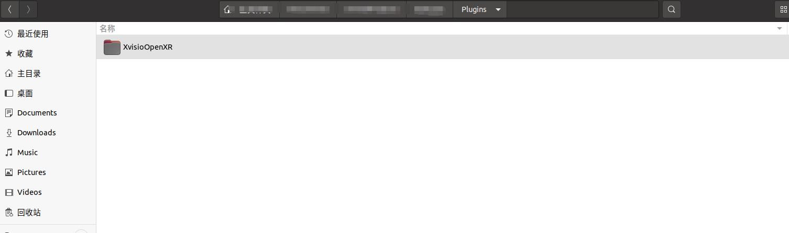

重启项目。现在你应该能在项目中看到 XVisio OpenXR 插件已启用。
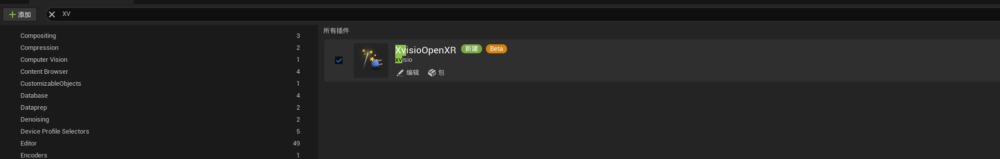

如何在虚幻引擎 5.1 中手动设置 XVisio 插件的分步指南。

1.下载XVisio插件。

2.创建 Plugins 文件夹，并将 XVisio 插件文件夹复制到其中。
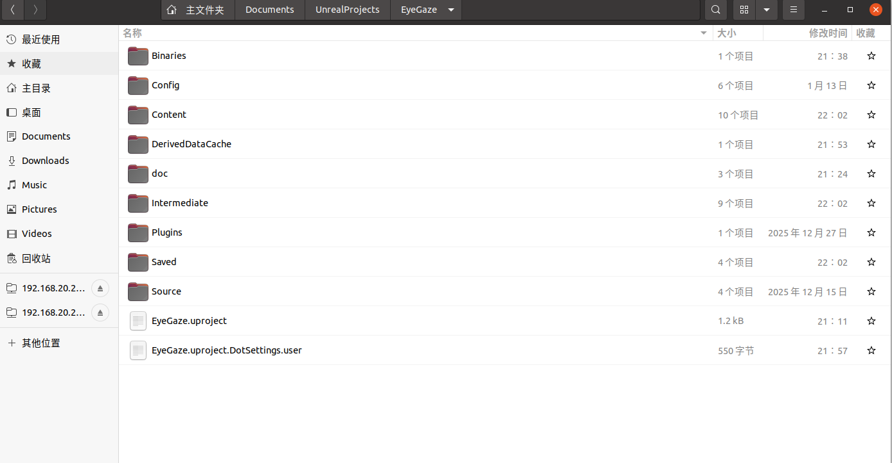

3.修改 name.uproject 文件并选择切换虚幻引擎版本。

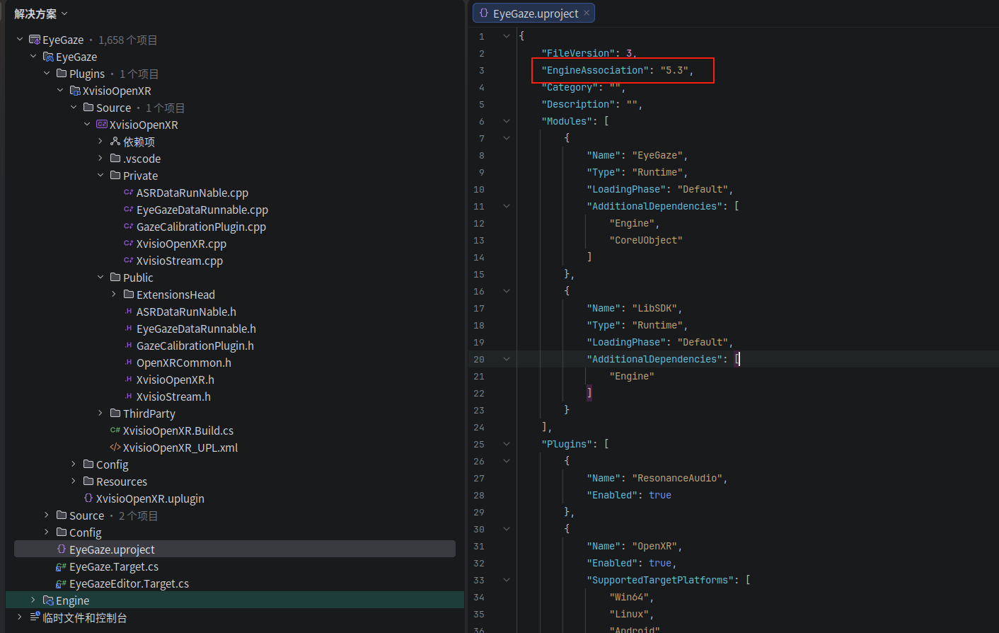

4.使用Rider打开项目，等待构建完成。启动项目名称.uproject。

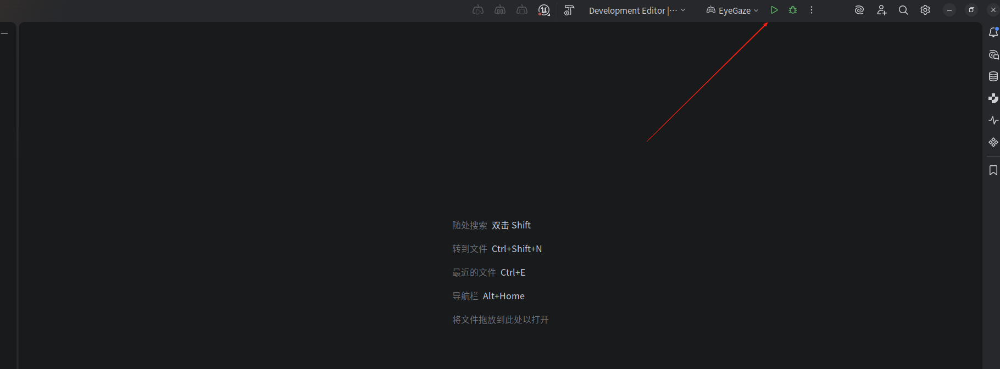

5.打开项目。

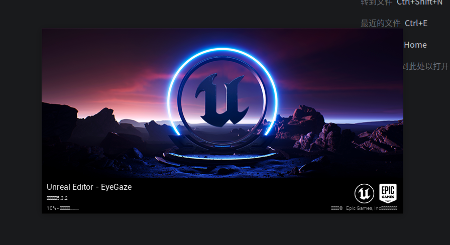

6.转到插件，检查所有OpenXR插件是否已按照以下屏幕截图所示的方式启用

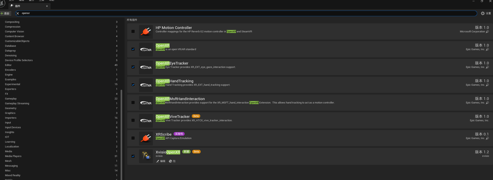

## 使用虚幻引擎5实现混合现实

您可以快速轻松地为 XVisio XR 头显开发混合现实应用程序。请按照以下说明开始操作。

从Actor父类创建一个名为BP_MRControls的新蓝图类。

<figure class="half">
    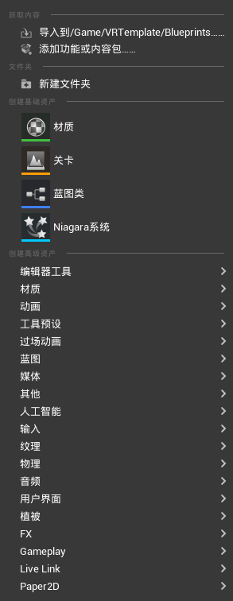
    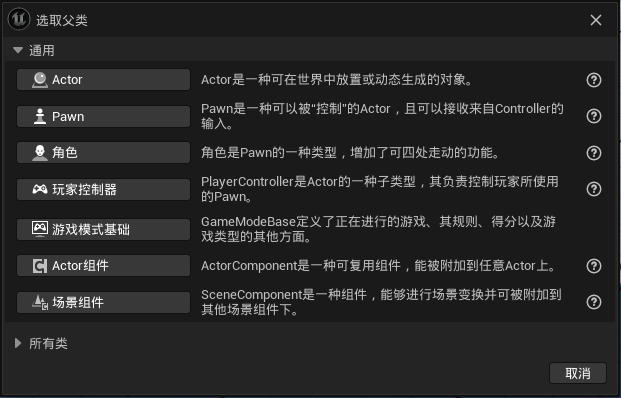
</figure>

将蓝图拖入场景中。

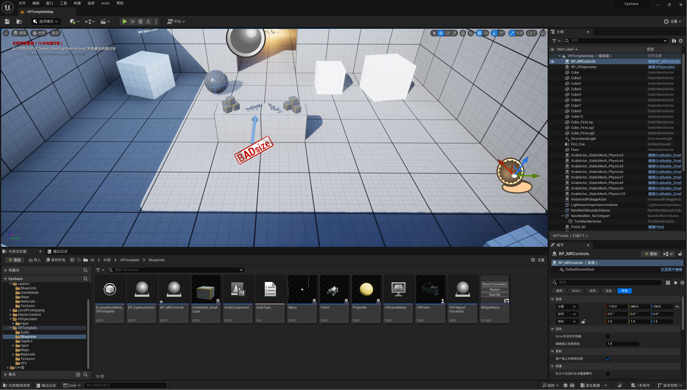

在BP_MRControls中，创建变量VRPawn > 将变量类型设置为VRPawn并启用私有。

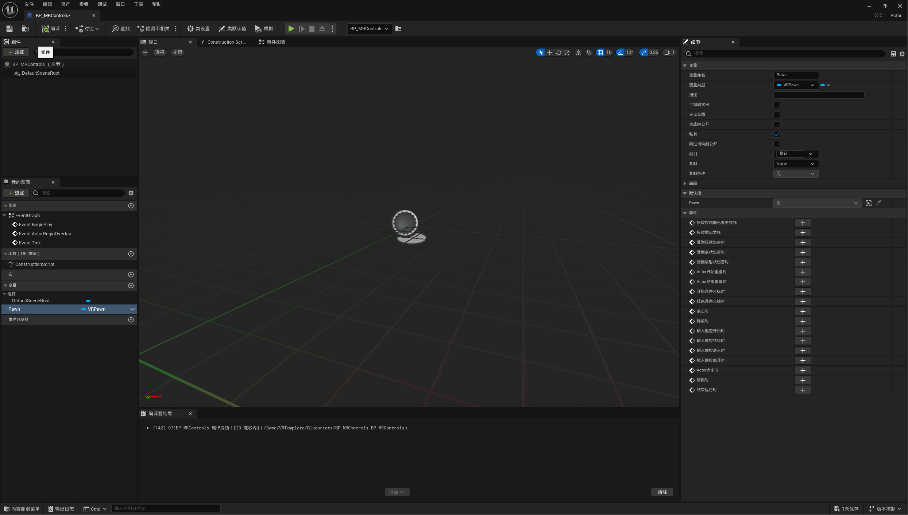

根据参考图重现逻辑。

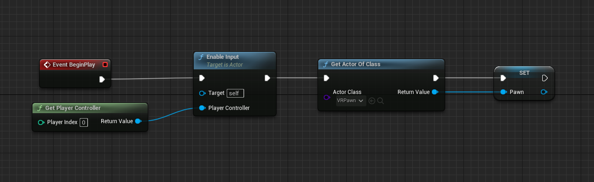

XVisio中混合现实功能是常开的功能。

控制 Alpha 通道最简单的方法是使用自定义后期处理。首先，您需要启用 Alpha 通道。在“项目设置” > “渲染” > “后期处理”中，将“在后期处理中启用 Alpha 通道支持”设置为“允许通过色调映射器”。

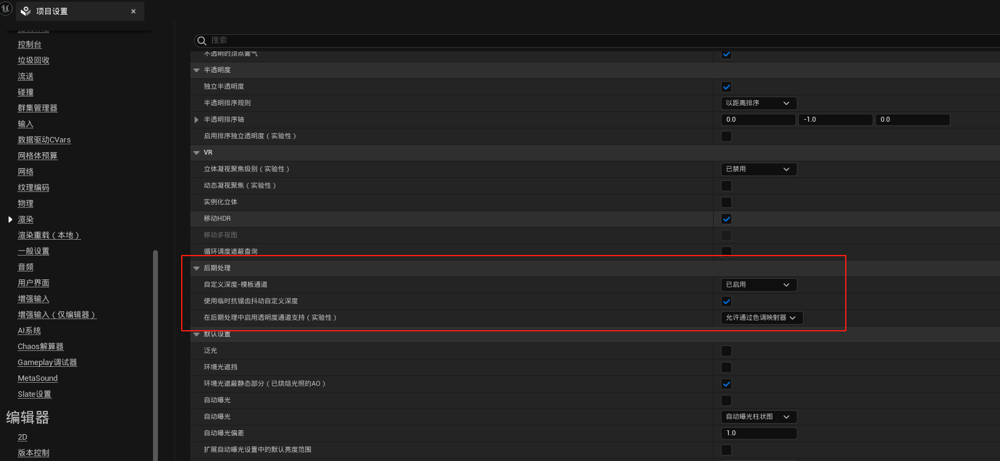

注意：如果您的项目使用了“史诗”或更高画质设置，则使用的颜色格式（PF_FloatRGBA 64位）会包含一个额外的 Alpha 通道，这可能会导致您在头显中只能看到视频直通图像。要解决此问题，请在引擎可扩展性设置中将“效果”级别更改为“高”，或将r.SceneColorFormat 设置为 3（PF_FloatRGB 32位）。

要设置r.SceneColorFormat > 选择“打开关卡蓝图” > 将事件 BeginPlay连接到“执行控制台命令”并添加r.SceneColorFormat 3。编译并保存。

<figure class="half">
    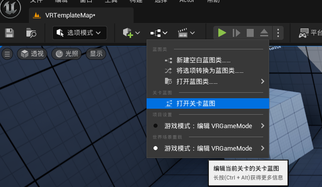
    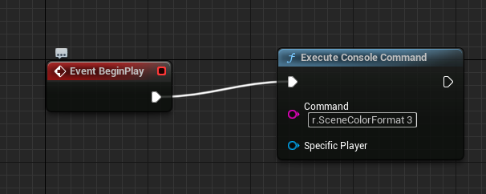
</figure>

此外，您还可以添加退出逻辑。

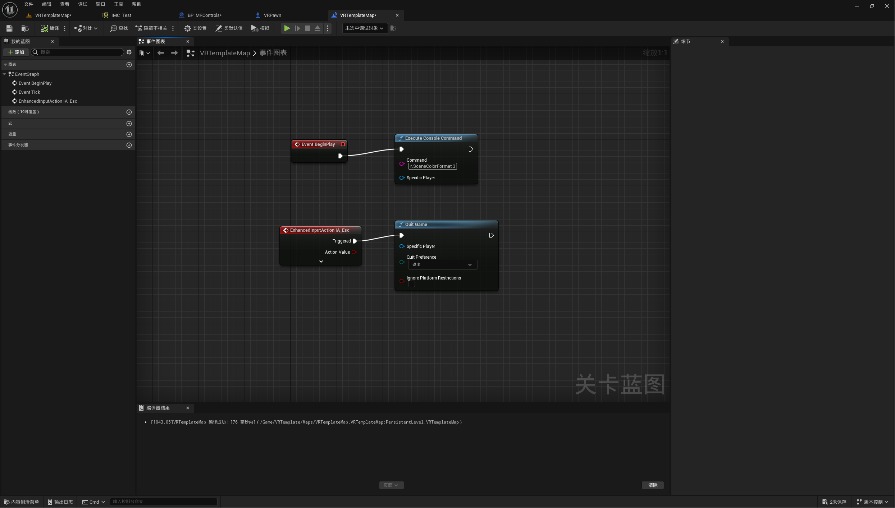

在场景中添加一个后期处理体积，并在“详细信息”面板的“后期处理体积设置”下启用“无限范围（无边界）”。

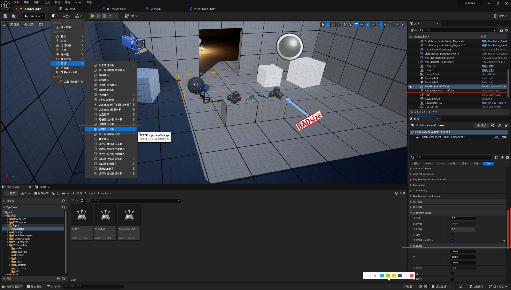

接下来，你需要创建用于控制 alpha 通道的后期处理材质。在你的项目中创建一个新材质，并将其命名为PP_MR。

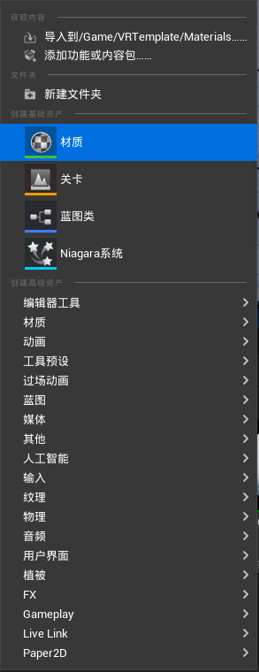

在材质编辑器中打开材质。

在“详细信息” > “材质”中，在“材质域”字段中选择“后处理”。

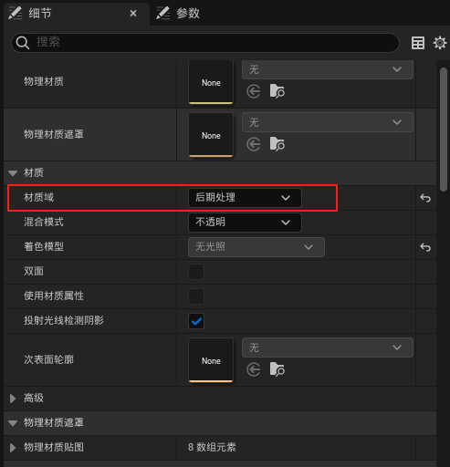

在“详细信息” > “后期处理素材”中，启用“输出 Alpha”。

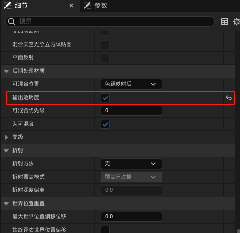

保存素材并返回后期处理体积的详细信息面板。

在渲染功能>后期处理材质>阵列中单击+ ，在下方出现的下拉列表中选择“资源引用” ，然后选择您刚刚创建的后期处理材质。

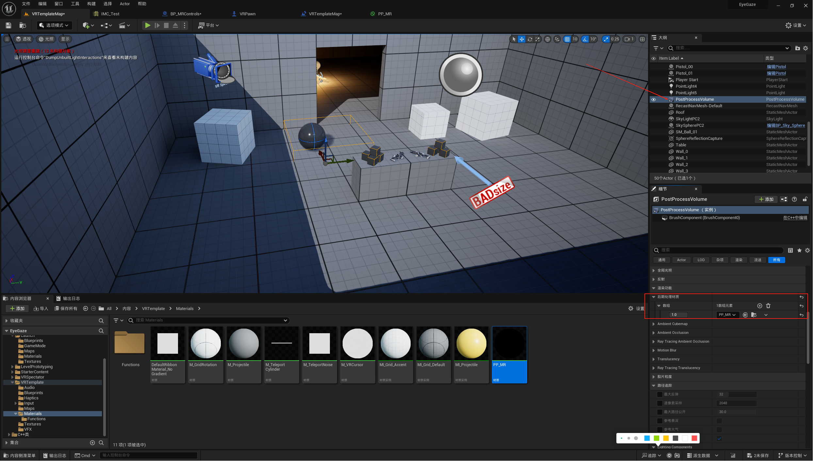

您的后期处理材质现已激活并影响渲染。现在您只需编辑该材质即可达到理想的最终效果。在材质编辑器中打开后期处理材质。

Alpha 通道可以通过多种方式控制。本示例展示了如何使用场景深度将视频透视摄像机的图像显示在背景中。请根据参考图像重现此逻辑。

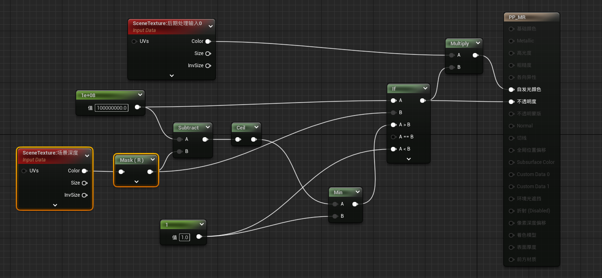

如果禁用天空球体，现在应该可以看到混合现实背景。在这个例子中，我们有一个“仅限VR对象”列表，其中包含天空球体和其他我们希望在混合现实模式下隐藏的对象。切换混合现实背景时，我们只需遍历此列表并设置其可见性即可。

要创建背景切换逻辑，请转到“项目设置” > “引擎-输入” > “动作映射” >创建MRBackgroundToggle并将其设置为键B（或者对于更高版本的 Unreal 5，请改用“增强输入动作” ）。

返回BP_MRControls并创建MRBackgroundToggle。

创建变量MRBackgroundEnabled ，并将变量类型设置为布尔值。创建变量VROnlyObjects ，并将其设置为Actor – Array ，使其成为公共变量。
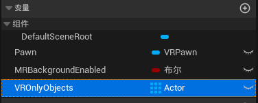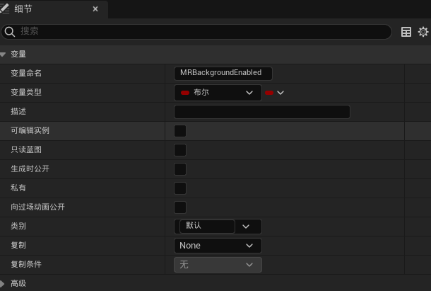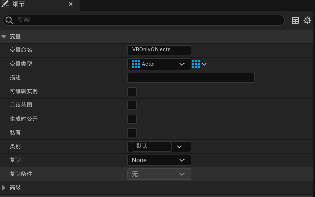

要查看结果，请转到“大纲视图”中的“视口”，然后选择“BP_MRControls”。在“BP_MRControls”中，转到“详细信息” > “默认值” > “VROnly Objects”，然后单击“+”选择在 XR 中不可见的对象（SkySphere、墙壁等）。

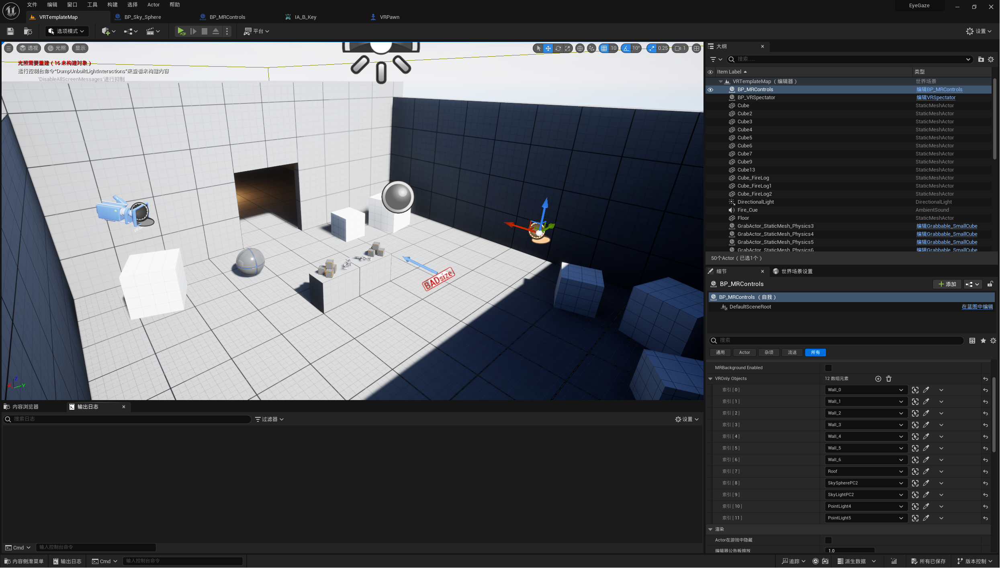

## 手部追踪

XVisio 头显支持手部追踪功能，并可与 Ultraleap Tracking 插件配合使用。XVisio OpenXR 运行时也支持XR_EXT_hand_tracking扩展，该扩展允许开发者使用 Unreal 内置的OpenXRHandTracking插件访问手部追踪数据。

**不使用插件进行手部追踪**

请确保项目中已启用 OpenXRHandTracking 插件。如果项目中同时启用了 XVisio OpenXR 插件，则 OpenXRHandTracking 插件应该会自动启用。

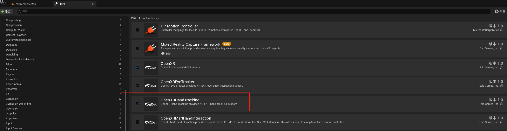

即使没有 Ultraleap Tracking 插件，您也可以访问基本的手部按键数据。

当手部追踪数据可用时，您可以使用“获取运动控制器数据”蓝图节点访问它。每只手的手部按键数据都存储在“手部按键位置”、“手部按键旋转”和“手部按键半径”数组中。

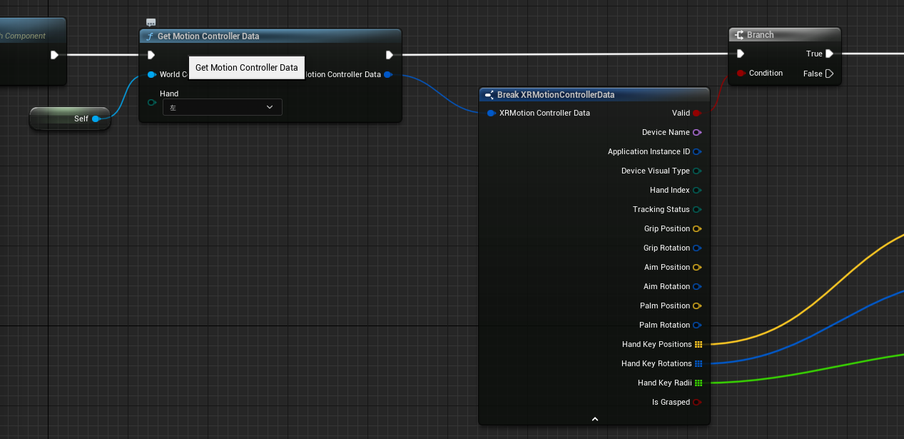

简单的手部追踪可视化

这个例子展示了一种可视化追踪手部动作的简单方法。首先在场景中添加一个空的 Actor 对象，并将其转换为蓝图。

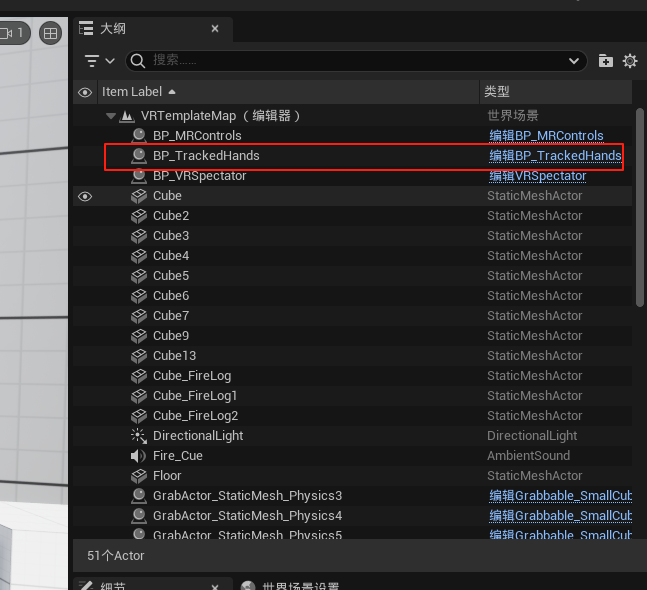

打开已创建的蓝图。

我们将通过为每个手部按键渲染一个立方体来可视化双手。首先，添加一个实例化静态网格体组件。选择一个静态网格体并为其指定材质。确保将“变换” > “移动性”设置为“可移动”。

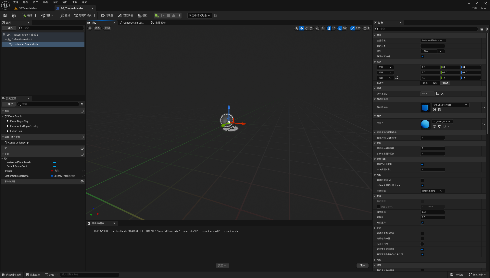

打开蓝图的事件图。

清除实例化静态网格的任何现有实例，并在Tick事件中使用Get Motion Controller Data获取最新的手部跟踪数据。

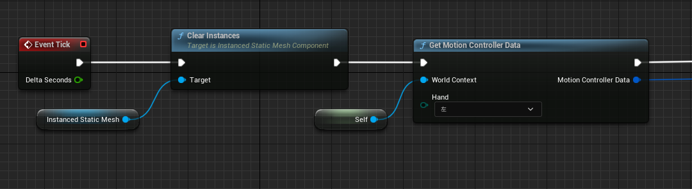

使用Break XRMotionControllerData节点访问结构体中的各个变量。仅当提供的运动控制器数据有效时才继续。

使用“手部按键位置”的长度，通过循环遍历数组for。使用“获取节点”获取每个索引对应的“手部按键位置”、“手部按键旋转角度”和“手部按键半径” 。

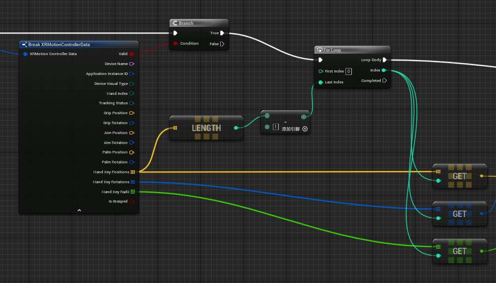

在循环体中for，使用“创建变换”节点为每个关键帧创建一个变换。然后，使用“添加实例世界空间”节点，使用给定的变换创建实例化静态网格体的实例。

另一只手重复以上步骤。

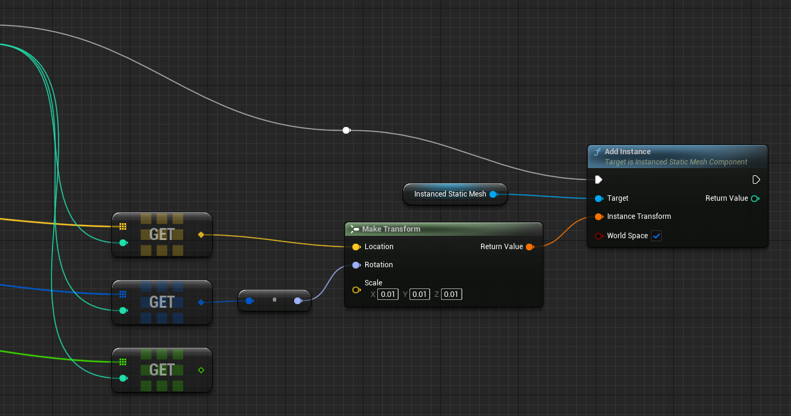

现在在VR 预览中运行场景，应该可以看到追踪到的手部模型渲染出来。如果您没有禁用实例化静态网格体的碰撞检测，还可以与物理效果进行交互。

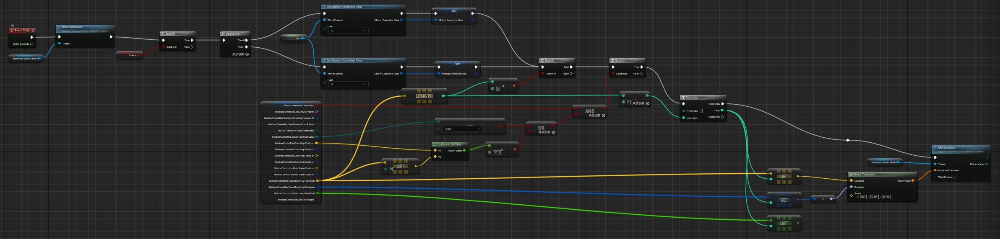

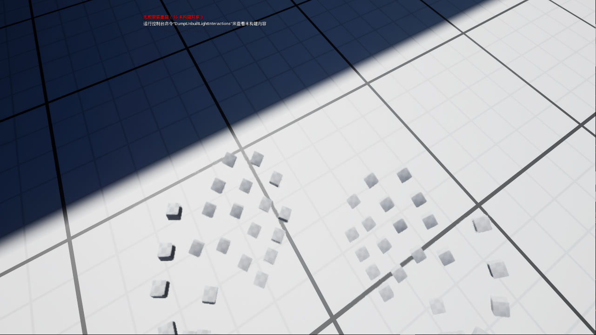

您可以进一步微调可视化效果，例如，当手靠近 VR 控制器时将其隐藏。x`

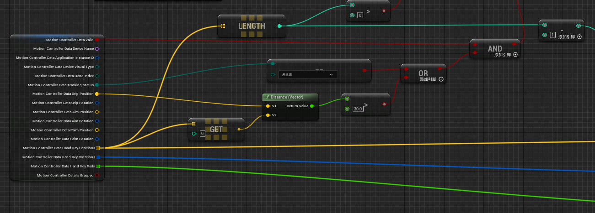

禁用在手部位置渲染运动控制器

目前，手部按键数据存储在运动控制器数据结构体中。因此，如果您的场景中启用了可视化功能的运动控制器组件，但没有连接任何运动控制器，则运动控制器组件会根据用户手部的位置渲染控制器模型。

要禁用此行为，当运动控制器数据中的跟踪状态为“未跟踪”时，您可以隐藏运动控制器（例如，在VR 模板中包含的VRPawn蓝图中）。

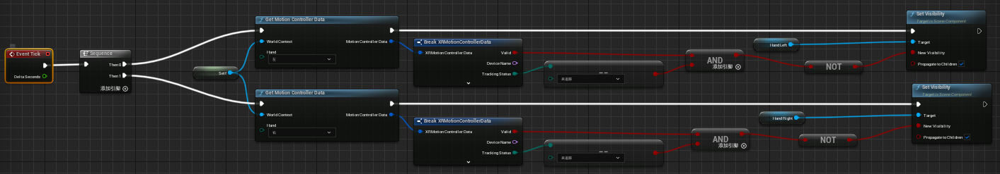

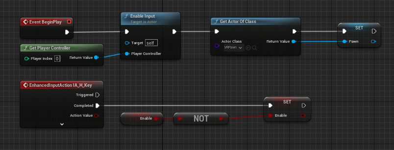

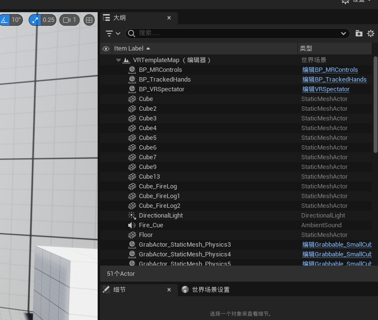