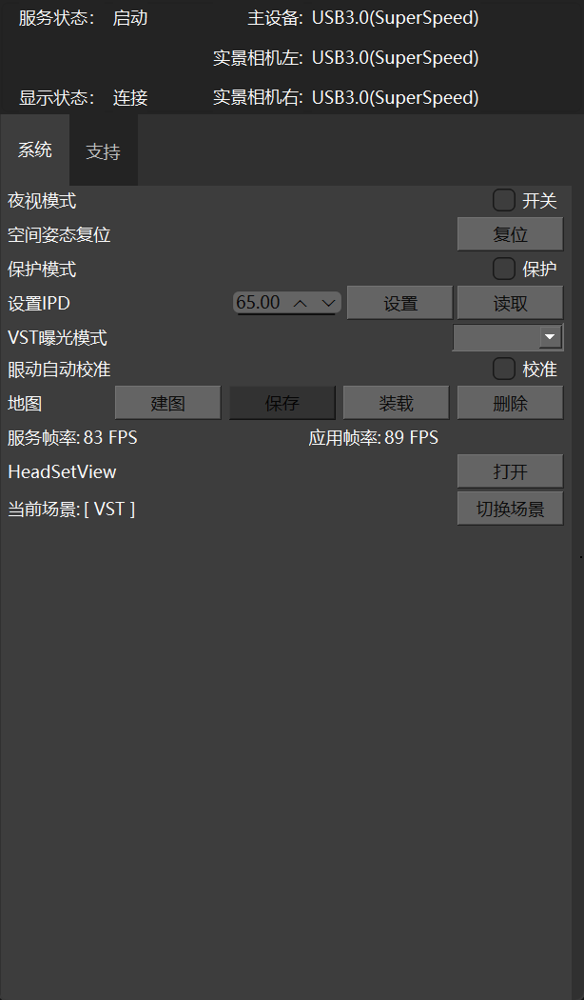
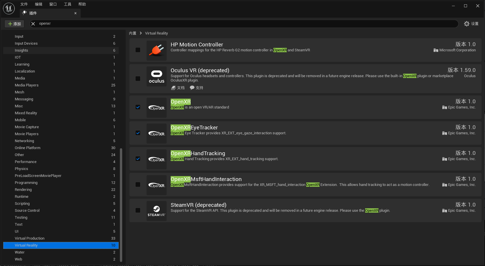
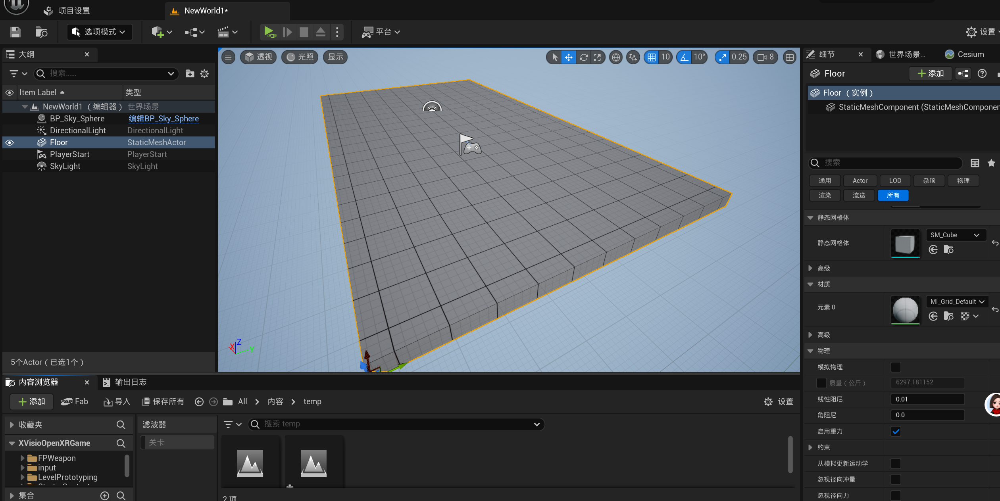
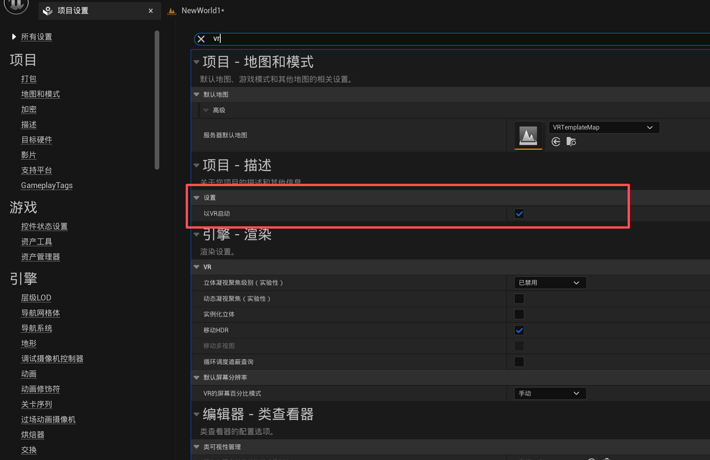
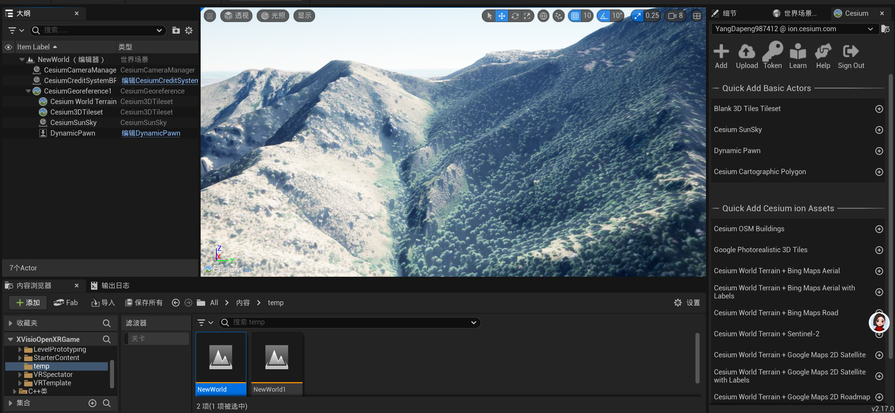
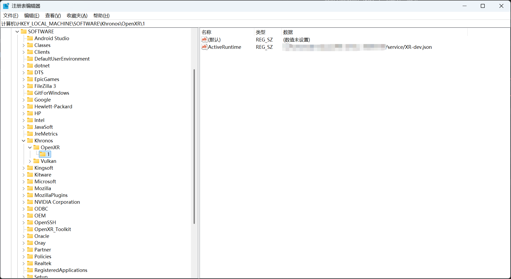
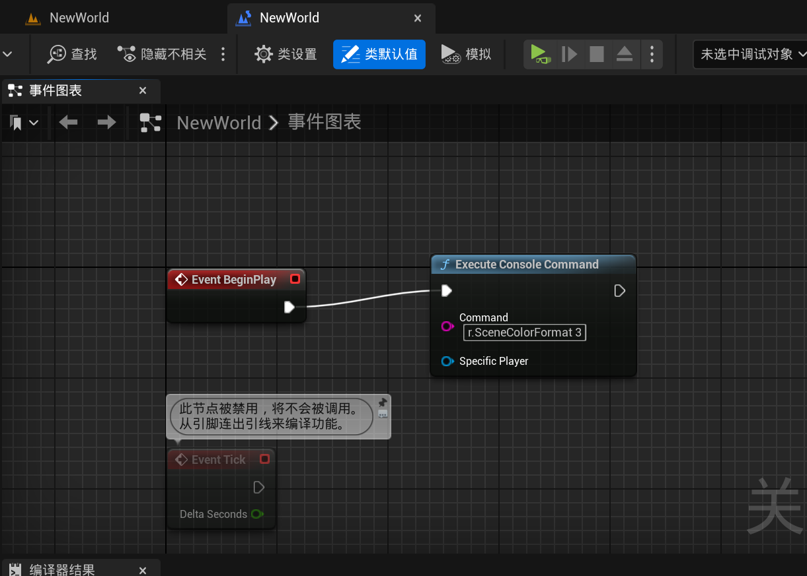
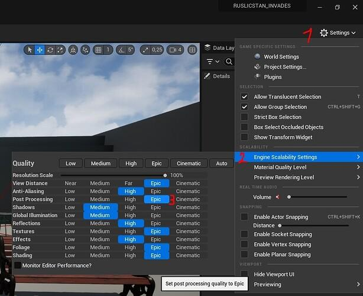

# Unreal Engine 5

## 概述

XVisio 对虚幻引擎的支持建立在虚幻引擎内置的 OpenXR 支持之上。这使得开发者无需编写任何 XVisio 特有的代码，即可使用虚幻引擎的常规二进制版本创建 XR 应用。它兼容所有当前一代的 XVisio 头显。

虚幻引擎内置的 OpenXR 插件不支持某些 XVisio 功能。这些功能由单独的 XVisio OpenXR 插件提供支持，该插件是对虚幻引擎内置插件的补充，并启用了额外的功能。

### 要求

要开始使用 Unreal 为 XVisio 头显进行开发，您需要以下工具：

一台满足XVisio头显设备系统要求的电脑
XVisio xervice （建议使用最新版本）
Unreal 5.0 或更高版本（建议使用更高版本以获得稳定性和新功能）
XVisio OpenXR 插件（需要此插件才能使用所有功能）

## 虚幻引擎5开发入门

1. 启动设备服务，服务启动成功状态如下

2. 在 Unreal 中启用 OpenXR

打开一个现有的虚幻引擎项目或创建一个新项目。

启用 OpenXR 插件。在插件中，搜索XR并激活OpenXR、OpenXREyeTracker和OpenXRHandTracking。在插件设置中，搜索VR并禁用OculusVR和SteamVR，只保留OpenXR开启。完成后，重启编辑器。

3. 选择VR 预览播放模式，然后点击播放按钮，即可在头戴式显示器内看到场景。

## 从空项目建立VR项目

1. 新建一个关卡，在关卡中放入光照和模型

2. 编辑项目设置，搜索vr，勾选以VR启动

3. 当前项目即可以VR启动

## cesium for ue

1. 新建一个关卡，在关卡中放入cesium的pawn，光照，terrain

2. 编辑项目设置，搜索vr，勾选以VR启动

3. 当前项目即可以VR启动

## 注意事项

1. win下服务启动前需要保证注册表中的runtime需要切换成当前服务的runtime

2. 在关卡设置中需要将r.SceneColorFormat 设置为 3（PF_FloatRGB 32位）。）

在关卡中设置的方式如下：
   
  

写入配置文件中，在DefaultEngine.ini中增加如下设置：

    /Script/Engine.RendererSettings
    r.SceneColorFormat=3

在编辑器中设置：

找到 Effects，把它从 Epic / Cinematic 改成 High

